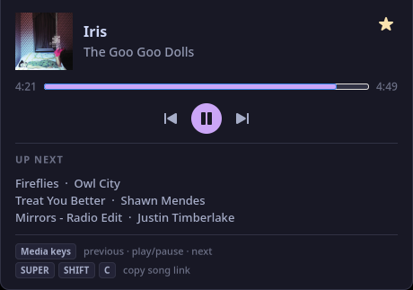

# spotify-peek

Your Spotify controls, one hover away. Move the pointer to the top center of your screen to reveal a compact card; move away to hide it.

<p align="center">
  
</p>

## What it does

- Shows album artwork, the current track, and its artists.
- Plays, pauses, skips, and seeks with a clickable progress bar.
- Shows the previous track and what's coming next.
- Saves or removes the current track from your liked songs.
- Copies a clean Spotify link when you click the artwork or track title.

Works with **Spotify Desktop** and **[Fastpotify](https://github.com/crmne/fastpotify)**. The card prefers a playing client, then a paused client with a loaded track; Fastpotify wins ties. Playback controls follow the client shown on the card.

Built in Rust with GTK4 and layer-shell for Linux Wayland desktops. A narrow trigger sits at the top edge; the card reserves no screen space. Refresh timers and API lookups run while the card is visible.

## Install

You need Rust, GTK **4.12 or newer**, gtk4-layer-shell, pkg-config, and their development libraries. Run it in a Wayland compositor that supports layer-shell, such as Hyprland.

```sh
git clone https://github.com/alexng353/spotify-peek.git
cd spotify-peek
cargo build --release --locked
install -Dm755 target/release/spotify-peek ~/.local/bin/spotify-peek
```

Launch `~/.local/bin/spotify-peek`, then hover over the top center of the screen. Add the same command to your compositor's startup configuration to launch it at login.

## Spotify account setup

Track details and playback controls use the player's local MPRIS interface. Queue, listening history, full artist lists, and liked-song controls use Spotify's Web API.

For those API features, peek reuses credentials from [spotlike](https://github.com/alexng353/spotlike):

1. Configure and authorize spotlike with your Spotify application.
2. Put `RSPOTIFY_CLIENT_ID` and `RSPOTIFY_CLIENT_SECRET` in `~/.config/spotlike/env` as `KEY=VALUE` lines.
3. Keep spotlike's authorized token at `~/.local/share/spotlike/token.json`.

Peek reads those files and keeps its own access-token cache in `~/.cache/spotify-peek/`. Credentials and tokens belong outside the repository.

The card's key hints describe the author's Hyprland bindings; peek does not register global shortcuts. Its click-to-copy action works independently of the `Super+Shift+C` binding to `spotlike copy`.

## Development

```sh
cargo test --locked                 # includes MPRIS tests; needs dbus-daemon
cargo clippy --locked --all-targets
cargo fmt --check
```

Use `--debug-open` to show the card at launch, `SPOTIFY_PEEK_DEBUG=1` for hover and copy diagnostics, and `--debug-cycle N` to exercise repeated opens and closes.

See [development notes](docs/development.md) for the layer-shell design, queue caching, styling, and historical memory measurements.
